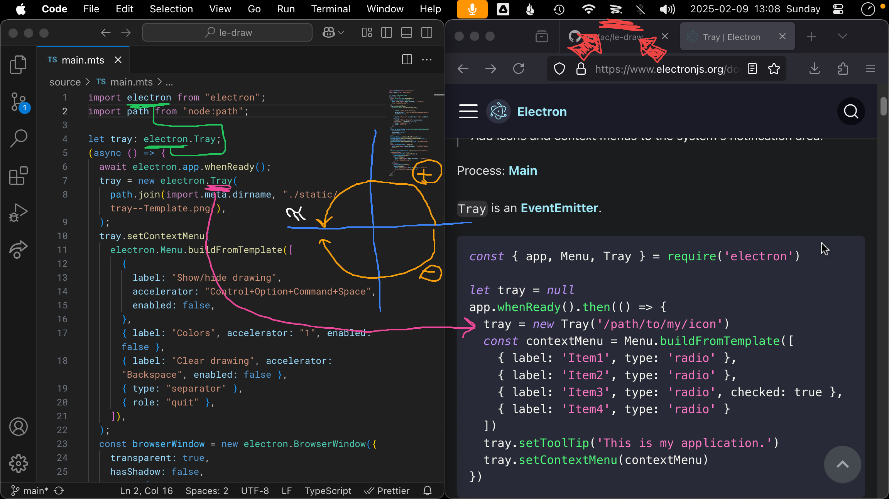

<h1 align="center">

 
Lê-draw
</h1>
<h6 align="center">Draw on top of your computer screen</h6>

## Keyboard shortcuts

|                       |            |
| --------------------- | ---------- |
| **Show/hide drawing** | `⌃⌥⌘Space` |
| **Colors**            | `0-9`      |
| **Clear drawing**     | `⌫`        |
